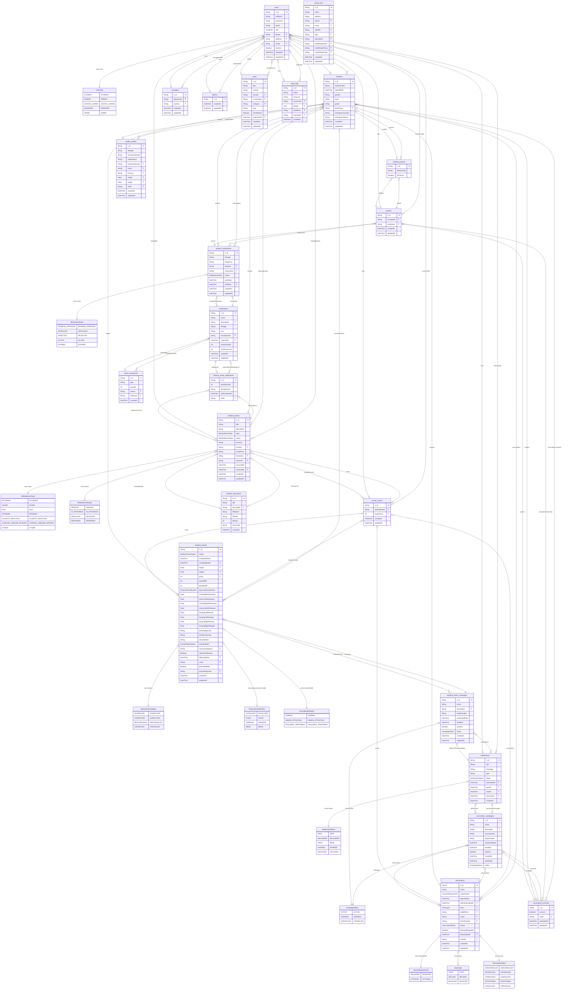

```mermaid
erDiagram

        UserRole {
            STUDENT STUDENT
PARENT PARENT
SCHOOL_NURSE SCHOOL_NURSE
MANAGER MANAGER
ADMIN ADMIN
        }
    


        MedicalEventType {
            ACCIDENT ACCIDENT
FEVER FEVER
FALL FALL
EPIDEMIC EPIDEMIC
ALLERGY_REACTION ALLERGY_REACTION
CHRONIC_DISEASE_EPISODE CHRONIC_DISEASE_EPISODE
OTHER OTHER
        }
    


        MedicalEventStatus {
            PENDING PENDING
IN_PROGRESS IN_PROGRESS
RESOLVED RESOLVED
REFERRED REFERRED
        }
    


        VaccinationStatus {
            UNSCHEDULED UNSCHEDULED
SCHEDULED SCHEDULED
COMPLETED COMPLETED
POSTPONED POSTPONED
CANCELLED CANCELLED
        }
    


        MedicalCheckStatus {
            SCHEDULED SCHEDULED
COMPLETED COMPLETED
RESCHEDULED RESCHEDULED
CANCELLED CANCELLED
        }
    


        MedicationStatus {
            PENDING_APPROVAL PENDING_APPROVAL
APPROVED APPROVED
REJECTED REJECTED
ACTIVE ACTIVE
EXPIRED EXPIRED
        }
    


        NotificationStatus {
            SENT SENT
DELIVERED DELIVERED
READ READ
EXPIRED EXPIRED
ARCHIVED ARCHIVED
        }
    


        VaccineRequirement {
            REQUIRED REQUIRED
OPTIONAL OPTIONAL
        }
    


        DoseType {
            FIRST FIRST
SECOND SECOND
BOOSTER BOOSTER
        }
    


        CampaignStatus {
            ACTIVE ACTIVE
FINISHED FINISHED
CANCELLED CANCELLED
        }
    


        PhysicalClassification {
            EXCELLENT EXCELLENT
GOOD GOOD
AVERAGE AVERAGE
WEAK WEAK
        }
    


        OverallHealthStatus {
            NORMAL NORMAL
NEEDS_ATTENTION NEEDS_ATTENTION
REQUIRES_TREATMENT REQUIRES_TREATMENT
        }
    
  "users" {
    String z_id "🗝️"
    String fullName 
    String password 
    String email 
    UserRole role 
    String phone "❓"
    String address "❓"
    String avatar "❓"
    Boolean isActive 
    DateTime createdAt 
    DateTime updatedAt 
    }
  

  "students" {
    String z_id "🗝️"
    String studentCode 
    DateTime dateOfBirth 
    String gender 
    String class 
    String grade 
    String bloodType "❓"
    String emergencyContact 
    String emergencyPhone 
    DateTime createdAt 
    DateTime updatedAt 
    }
  

  "parents" {
    String z_id "🗝️"
    String occupation "❓"
    String workplace "❓"
    DateTime createdAt 
    DateTime updatedAt 
    }
  

  "school_nurses" {
    String z_id "🗝️"
    String specialization "❓"
    Int experience "❓"
    DateTime createdAt 
    DateTime updatedAt 
    }
  

  "managers" {
    String z_id "🗝️"
    String department "❓"
    String position "❓"
    DateTime createdAt 
    DateTime updatedAt 
    }
  

  "admins" {
    String z_id "🗝️"
    DateTime createdAt 
    DateTime updatedAt 
    }
  

  "student_parents" {
    String z_id "🗝️"
    String relationship 
    Boolean isPrimary 
    }
  

  "health_profiles" {
    String z_id "🗝️"
    String allergies 
    String chronicDiseases 
    String medications 
    String treatmentHistory "❓"
    String vision "❓"
    String hearing "❓"
    Float height "❓"
    Float weight "❓"
    String notes "❓"
    DateTime createdAt 
    DateTime updatedAt 
    }
  

  "medical_events" {
    String z_id "🗝️"
    String title 
    String description 
    MedicalEventType type 
    MedicalEventStatus status 
    String severity 
    String location "❓"
    String symptoms 
    String treatment "❓"
    String outcome "❓"
    DateTime occurredAt 
    DateTime resolvedAt "❓"
    DateTime createdAt 
    DateTime updatedAt 
    }
  

  "medications" {
    String z_id "🗝️"
    String name 
    String description "❓"
    String dosage 
    String unit 
    String manufacturer "❓"
    DateTime expiryDate "❓"
    Int stockQuantity 
    Int minStockLevel 
    DateTime createdAt 
    DateTime updatedAt 
    }
  

  "student_medications" {
    String z_id "🗝️"
    String dosage 
    String frequency 
    String duration "❓"
    String instructions "❓"
    MedicationStatus status 
    DateTime startDate 
    DateTime endDate "❓"
    DateTime createdAt 
    DateTime updatedAt 
    }
  

  "medical_event_medications" {
    String z_id "🗝️"
    Int quantityUsed 
    String dosageGiven 
    DateTime administeredAt 
    String notes "❓"
    }
  

  "stock_movements" {
    String z_id "🗝️"
    String type 
    Int quantity 
    String reason "❓"
    String reference "❓"
    DateTime createdAt 
    }
  

  "vaccination_campaigns" {
    String z_id "🗝️"
    String name 
    String description "❓"
    String vaccinationId 
    String targetGrades 
    DateTime scheduledDate 
    DateTime deadline 
    Boolean isActive 
    DateTime createdAt 
    DateTime updatedAt 
    CampaignStatus status 
    }
  

  "vaccinations" {
    String z_id "🗝️"
    String name 
    VaccineRequirement requirement 
    DateTime expiredDate 
    DateTime administeredDate "❓"
    DoseType dose "❓"
    String sideEffects "❓"
    String notes "❓"
    String batchNumber "❓"
    VaccinationStatus status 
    Boolean followUpRequired 
    DateTime followUpDate "❓"
    String reaction "❓"
    DateTime createdAt 
    DateTime updatedAt 
    }
  

  "vaccination_consents" {
    String z_id "🗝️"
    Boolean consent 
    String notes "❓"
    DateTime submittedAt 
    DateTime updatedAt 
    }
  

  "medical_check_campaigns" {
    String z_id "🗝️"
    String name 
    String description "❓"
    String targetGrades 
    DateTime scheduledDate 
    DateTime deadline 
    Boolean isActive 
    CampaignStatus status 
    DateTime createdAt 
    DateTime updatedAt 
    }
  

  "medical_checks" {
    String z_id "🗝️"
    MedicalCheckStatus status 
    DateTime scheduledDate 
    DateTime completedDate "❓"
    Float height "❓"
    Float weight "❓"
    Int pulse "❓"
    Int systolicBP 
    Int diastolicBP 
    PhysicalClassification physicalClassification 
    Float visionRightNoGlasses 
    Float visionLeftNoGlasses 
    Float visionRightWithGlasses 
    Float visionLeftWithGlasses 
    Float hearingLeftNormal 
    Float hearingLeftWhisper 
    Float hearingRightNormal 
    Float hearingRightWhisper 
    String dentalUpperJaw 
    String dentalLowerJaw 
    String clinicalNotes 
    OverallHealthStatus overallHealth 
    String recommendations "❓"
    Boolean requiresFollowUp 
    DateTime followUpDate "❓"
    String notes "❓"
    Boolean parentNotified 
    String parentResponse "❓"
    DateTime createdAt 
    DateTime updatedAt 
    }
  

  "medical_documents" {
    String z_id "🗝️"
    String title 
    String description "❓"
    String fileName 
    String filePath 
    Int fileSize 
    String mimeType 
    DateTime createdAt 
    }
  

  "posts" {
    String z_id "🗝️"
    String title 
    String content 
    String excerpt "❓"
    String coverImage "❓"
    String category "❓"
    String tags 
    Boolean isPublished 
    DateTime publishedAt "❓"
    DateTime createdAt 
    DateTime updatedAt 
    }
  

  "notifications" {
    String z_id "🗝️"
    String title 
    String message 
    String type 
    NotificationStatus status 
    DateTime scheduledAt "❓"
    DateTime sentAt "❓"
    DateTime readAt "❓"
    DateTime archivedAt "❓"
    DateTime createdAt 
    }
  

  "audit_logs" {
    String z_id "🗝️"
    String action 
    String resource 
    String resourceId "❓"
    Json details "❓"
    String ipAddress "❓"
    String userAgent "❓"
    DateTime createdAt 
    }
  

  "school_info" {
    String z_id "🗝️"
    String name 
    String address 
    String phone "❓"
    String email "❓"
    String website "❓"
    String logo "❓"
    String description "❓"
    String healthDeptHead "❓"
    String healthDeptPhone "❓"
    String healthDeptEmail "❓"
    DateTime createdAt 
    DateTime updatedAt 
    }
  
    "users" o|--|| "UserRole" : "enum:role"
    "users" o{--}o "students" : "studentProfile"
    "users" o{--}o "parents" : "parentProfile"
    "users" o{--}o "school_nurses" : "nurseProfile"
    "users" o{--}o "managers" : "managerProfile"
    "users" o{--}o "admins" : "adminProfile"
    "users" o{--}o "posts" : "createdPosts"
    "users" o{--}o "medical_events" : "createdEvents"
    "users" o{--}o "notifications" : "notifications"
    "users" o{--}o "audit_logs" : "auditLogs"
    "students" o|--|| "users" : "user"
    "students" o{--}o "student_parents" : "parents"
    "students" o{--}o "health_profiles" : "healthProfile"
    "students" o{--}o "medical_events" : "medicalEvents"
    "students" o{--}o "medical_checks" : "medicalChecks"
    "students" o{--}o "student_medications" : "medications"
    "students" o{--}o "vaccination_consents" : "vaccinationConsents"
    "students" o{--}o "vaccinations" : "vaccinations"
    "parents" o|--|| "users" : "user"
    "parents" o{--}o "student_parents" : "children"
    "parents" o{--}o "student_medications" : "medications"
    "parents" o{--}o "vaccination_consents" : "vaccinationConsents"
    "school_nurses" o|--|| "users" : "user"
    "school_nurses" o{--}o "medical_events" : "handledEvents"
    "school_nurses" o{--}o "medical_checks" : "medicalChecks"
    "school_nurses" o{--}o "vaccinations" : "vaccinations"
    "managers" o|--|| "users" : "user"
    "admins" o|--|| "users" : "user"
    "student_parents" o|--|| "students" : "student"
    "student_parents" o|--|| "parents" : "parent"
    "health_profiles" o|--|| "students" : "student"
    "medical_events" o|--|| "MedicalEventType" : "enum:type"
    "medical_events" o|--|| "MedicalEventStatus" : "enum:status"
    "medical_events" o|--|| "students" : "student"
    "medical_events" o|--|o "school_nurses" : "nurse"
    "medical_events" o|--|| "users" : "createdBy"
    "medical_events" o{--}o "medical_event_medications" : "medicationsUsed"
    "medical_events" o{--}o "medical_documents" : "documents"
    "medications" o{--}o "student_medications" : "studentMedications"
    "medications" o{--}o "medical_event_medications" : "medicalEventMedications"
    "medications" o{--}o "stock_movements" : "stockMovements"
    "student_medications" o|--|| "MedicationStatus" : "enum:status"
    "student_medications" o|--|| "students" : "student"
    "student_medications" o|--|| "parents" : "parent"
    "student_medications" o|--|| "medications" : "medication"
    "medical_event_medications" o|--|| "medical_events" : "medicalEvent"
    "medical_event_medications" o|--|| "medications" : "medication"
    "stock_movements" o|--|| "medications" : "medication"
    "vaccination_campaigns" o|--|| "CampaignStatus" : "enum:status"
    "vaccination_campaigns" o{--}o "notifications" : "notifications"
    "vaccination_campaigns" o{--}o "vaccination_consents" : "consents"
    "vaccination_campaigns" o{--}o "vaccinations" : "vaccinations"
    "vaccinations" o|--|| "VaccineRequirement" : "enum:requirement"
    "vaccinations" o|--|o "DoseType" : "enum:dose"
    "vaccinations" o|--|| "VaccinationStatus" : "enum:status"
    "vaccinations" o|--|o "students" : "student"
    "vaccinations" o|--|o "school_nurses" : "nurse"
    "vaccinations" o|--|o "vaccination_campaigns" : "campaign"
    "vaccination_consents" o|--|| "vaccination_campaigns" : "campaign"
    "vaccination_consents" o|--|| "students" : "student"
    "vaccination_consents" o|--|| "parents" : "parent"
    "medical_check_campaigns" o|--|| "CampaignStatus" : "enum:status"
    "medical_check_campaigns" o{--}o "medical_checks" : "medicalChecks"
    "medical_check_campaigns" o{--}o "notifications" : "notifications"
    "medical_checks" o|--|| "MedicalCheckStatus" : "enum:status"
    "medical_checks" o|--|| "PhysicalClassification" : "enum:physicalClassification"
    "medical_checks" o|--|| "OverallHealthStatus" : "enum:overallHealth"
    "medical_checks" o|--|| "students" : "student"
    "medical_checks" o|--|| "medical_check_campaigns" : "campaign"
    "medical_checks" o|--|o "school_nurses" : "nurse"
    "medical_documents" o|--|o "medical_events" : "medicalEvent"
    "posts" o|--|| "users" : "author"
    "notifications" o|--|| "NotificationStatus" : "enum:status"
    "notifications" o|--|| "users" : "user"
    "notifications" o|--|o "vaccination_campaigns" : "vaccinationCampaign"
    "notifications" o|--|o "medical_check_campaigns" : "medicalCheckCampaign"
    "audit_logs" o|--|o "users" : "user"
```
